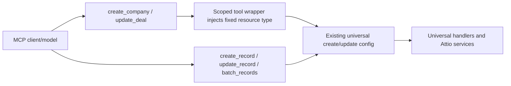

# feat: Add scoped high-frequency write tools

## Summary

Add scoped company and deal write tools to the default universal tool catalogue so models can choose explicit high-frequency operations instead of supplying `resource_type` to generic write tools. The implementation should reuse the existing universal create/update services, keep canonical MCP snake_case naming, and tighten tool descriptions for clearer selection boundaries.

---

## Problem Frame

Issue #1175 reports that the universal tool strategy reduces tool count but pushes too much routing and payload responsibility onto the model. The highest-risk surface is writes: an incorrect `resource_type`, broad `record_data`, or ambiguous batch operation can mutate the wrong Attio object or create invalid records.

---

## Assumptions

_This plan was authored without synchronous user confirmation. The items below are agent inferences that fill gaps in the input -- un-validated bets that should be reviewed before implementation proceeds._

- The first scoped write slice should cover companies and deals because the issue explicitly names `create-company` and `update-deal` style tools and the repo already has deal-specific validation paths.
- Canonical tool names should be snake_case (`create_company`, `update_company`, `create_deal`, `update_deal`) to match the repo's MCP naming standards, with no new kebab-case aliases.
- Scoped tools should supplement, not remove, universal write tools in this PR so existing clients do not lose behavior.
- Strict per-resource schemas should require only stable identifiers and a resource-specific data object while leaving actual Attio attribute validation to existing metadata and field-validation services.

---

## Requirements

- R1. Add scoped high-frequency write tools for companies and deals that do not require callers to provide `resource_type`.
- R2. Route scoped tools through the same universal create/update behavior used by `create_record` and `update_record` so validation, formatting, structured output, and field persistence behavior stay consistent.
- R3. Improve tool metadata so scoped tools, universal CRUD tools, and batch tools have clearer capability, boundary, and recovery guidance.
- R4. Preserve default universal mode behavior and backward compatibility for existing universal tools.
- R5. Add tests that prove scoped tools are registered, have constrained schemas, inject the intended resource type, and do not weaken existing naming or alias invariants.

---

## Scope Boundaries

- Do not remove `create_record`, `update_record`, or `batch_records`.
- Do not re-enable the full legacy resource-specific catalogue in default mode.
- Do not add broad aliases that increase the tool-name surface without a compatibility need.
- Do not build a generated per-object tool system in this PR; keep the scope to the high-frequency tools requested by the issue.

### Deferred to Follow-Up Work

- Additional scoped tools for people, tasks, lists, notes, or delete operations: follow-up issue/PR after company and deal writes prove the pattern.
- Deeper search-tool consolidation or ranking changes: separate design pass, because Issue #1175 mentions overlap but acceptance criteria focus on scoped high-frequency tools and metadata.
- Glama-specific scoring measurement: follow-up validation once the new tool catalogue is published or inspectable by that service.

---

## Context & Research

### Relevant Code and Patterns

- `src/handlers/tool-configs/universal/core/crud-operations.ts` defines `create_record` and `update_record`, including validation, error handling, formatting, and structured output.
- `src/handlers/tool-configs/universal/core/index.ts` and `src/handlers/tool-configs/universal/index.ts` aggregate universal tool configs and definitions exposed in default mode.
- `src/handlers/tool-configs/universal/schemas/core-schemas.ts` contains the existing generic CRUD schemas and shows the repo policy of `additionalProperties: false` at the tool parameter boundary.
- `src/handlers/tools/registry.ts` exposes only `UNIVERSAL`, lists, and workspace members when `DISABLE_UNIVERSAL_TOOLS` is not set.
- `src/constants/tool-names.ts` centralizes canonical snake_case tool names.
- `test/handlers/tool-configs/universal/tool-name-consistency.test.ts` enforces snake_case, verb-first naming, definition/config key matching, and alias registry expectations.
- `test/handlers/tools/registry-mode.test.ts` verifies mode-based tool exposure.

### Institutional Learnings

- No directly relevant `docs/solutions/` entries were present in this checkout during planning.

### External References

- External research skipped: the repo already has direct patterns for MCP tool schemas, universal write handlers, and naming tests.

---

## Key Technical Decisions

- Scoped wrappers over duplicate business logic: use small tool configs that inject fixed resource types into existing universal handlers instead of copying create/update implementation.
- Snake_case canonical names only: follow the current MCP compliance standard and avoid expanding the deprecated alias registry for new tools.
- Constrained top-level schemas: remove `resource_type` from scoped tool inputs and reject unknown top-level parameters, while keeping `record_data` flexible enough for Attio custom fields.
- Metadata polish in the same PR: update universal write and batch descriptions so the model sees explicit guidance on when to use scoped tools versus generic ones.

---

## Open Questions

### Resolved During Planning

- Should scoped tools be legacy resource-specific tools or default universal catalogue tools? Use the default universal catalogue; legacy resource configs are intentionally hidden in normal mode.
- Should tool names be kebab-case like the issue examples? No; the repo has explicit tests and constants for snake_case canonical names.

### Deferred to Implementation

- Exact helper/module names for scoped CRUD wrappers: choose the smallest structure that keeps `core/index.ts` readable once the implementation is open.
- Final schema field descriptions for deal data: refine against existing deal validation and tests while implementing.

---

## High-Level Technical Design

> _This illustrates the intended approach and is directional guidance for review, not implementation specification. The implementing agent should treat it as context, not code to reproduce._

The scoped tools are entry-point aliases in behavior, not alternate write pipelines. They should reduce model ambiguity while keeping one implementation path for validation and formatting.

---

## Implementation Units

- U1. **Add scoped CRUD tool configs**

**Goal:** Introduce company and deal create/update tool configs in the universal core area that inject fixed resource types before delegating to existing universal create/update handlers.

**Requirements:** R1, R2, R4

**Dependencies:** None

**Files:**

- Create or modify: `src/handlers/tool-configs/universal/core/scoped-crud-operations.ts`
- Modify: `src/handlers/tool-configs/universal/core/index.ts`
- Modify: `src/handlers/tool-configs/universal/index.ts`
- Test: `test/handlers/tool-configs/universal/scoped-crud-tools.test.ts`

**Approach:**

- Define four scoped tool configs for company/deal create/update.
- Reuse `createRecordConfig` and `updateRecordConfig` behavior by adding the fixed resource type before delegation.
- Preserve structured output and human-readable formatting from the universal path.
- Register scoped configs and definitions in the universal catalogue so they are exposed in default mode.

**Execution note:** Implement the registration and delegation tests first; these are contract-level changes to the public MCP tool surface.

**Patterns to follow:**

- `src/handlers/tool-configs/universal/core/crud-operations.ts`
- `src/handlers/tool-configs/universal/core/index.ts`
- `test/handlers/tool-configs/universal/tool-name-consistency.test.ts`

**Test scenarios:**

- Happy path: calling `create_company` with `record_data` delegates to the create path with `resource_type: "companies"` and returns the existing structured output shape.
- Happy path: calling `update_deal` with `record_id` and `record_data` delegates to the update path with `resource_type: "deals"`.
- Error path: caller-supplied `resource_type` is not accepted by scoped schemas and cannot override the fixed type.
- Integration: `universalToolConfigs` and `universalToolDefinitions` include all scoped tools under matching keys.

**Verification:**

- The default tool registry can find the scoped tools, and existing universal CRUD tests still pass.

---

- U2. **Define scoped schemas and descriptions**

**Goal:** Give scoped tools stricter top-level input schemas and clearer descriptions than the generic universal write tools.

**Requirements:** R1, R3, R5

**Dependencies:** U1

**Files:**

- Modify: `src/handlers/tool-configs/universal/core/scoped-crud-operations.ts`
- Modify: `src/constants/tool-names.ts`
- Test: `test/handlers/tool-configs/universal/scoped-crud-tools.test.ts`
- Test: `test/handlers/tool-configs/universal/tool-name-consistency.test.ts`

**Approach:**

- Add canonical names to `TOOL_NAMES`.
- Define schemas with no `resource_type`, required `record_data` for creates, required `record_id` plus `record_data` for updates, and `additionalProperties: false`.
- Use `formatToolDescription` to state capability, non-goals, constraints, and recovery hints.
- Keep `record_data` open for custom Attio attributes but make examples and descriptions resource-specific.

**Patterns to follow:**

- `src/handlers/tools/standards/index.ts`
- `src/handlers/tool-configs/universal/schemas/core-schemas.ts`
- `src/constants/tool-names.ts`

**Test scenarios:**

- Happy path: each scoped definition has a matching name/key and snake_case verb-first name.
- Edge case: scoped schemas do not expose `resource_type` and reject unrelated top-level properties.
- Error path: tests fail if a scoped tool is omitted from the complete tool coverage checks.

**Verification:**

- Naming, schema, and definition consistency tests cover the new tool surface.

---

- U3. **Clarify generic tool metadata boundaries**

**Goal:** Make the generic universal write/search/batch tools less likely to be selected when a scoped write tool is the safer fit.

**Requirements:** R3, R4

**Dependencies:** U1, U2

**Files:**

- Modify: `src/handlers/tool-configs/universal/core/crud-operations.ts`
- Modify: `src/handlers/tool-configs/universal/operations/batch-operations.ts`
- Modify: `src/handlers/tool-configs/universal/operations/index.ts`
- Test: `test/handlers/tool-configs/universal/scoped-crud-tools.test.ts`

**Approach:**

- Update `create_record` and `update_record` descriptions to identify them as generic cross-resource tools and direct common company/deal writes to the scoped tools.
- Add or improve the `batch_records` definition description if it lacks a clear capability/boundary/recovery hint.
- Keep behavior unchanged; this unit is metadata-only aside from test coverage.

**Patterns to follow:**

- Existing `formatToolDescription` usage in universal definitions.
- Tool description tests that assert durable phrases rather than brittle full strings.

**Test scenarios:**

- Happy path: generic CRUD descriptions mention when to prefer scoped company/deal tools.
- Happy path: batch metadata clearly distinguishes multi-operation bulk work from single-record scoped writes.
- Regression: metadata changes do not alter schemas or handlers for existing generic tools.

**Verification:**

- Tool definition tests prove descriptions carry the intended selection guidance without changing runtime behavior.

---

- U4. **Update docs and changelog**

**Goal:** Document the new public MCP tool names and record the user-facing tool-surface change.

**Requirements:** R1, R3, R4

**Dependencies:** U1, U2, U3

**Files:**

- Modify: `README.md` or the repo's current tool reference documentation if a more specific file is found during implementation
- Modify: `CHANGELOG.md`
- Test: documentation-only verification in existing lint/docs checks

**Approach:**

- Add concise examples or a tool list entry for `create_company`, `update_company`, `create_deal`, and `update_deal`.
- Preserve guidance that generic universal tools still exist for uncommon objects or dynamic routing.
- Add an `[Unreleased]` changelog entry because this changes user-visible tool capabilities.

**Patterns to follow:**

- Existing README/tool documentation style.
- `CHANGELOG.md` Keep a Changelog structure.

**Test scenarios:**

- Test expectation: none -- documentation and changelog updates have no runtime behavior.

**Verification:**

- Docs name the new canonical tools and do not reference deprecated kebab-case names as primary.

---

## System-Wide Impact

- **Interaction graph:** MCP tool discovery and dispatch gain four new universal entries; the underlying Attio write service path remains shared with `create_record` and `update_record`.
- **Error propagation:** Scoped tools should surface the same secure universal errors as generic create/update tools, with fixed resource context.
- **State lifecycle risks:** No new persistence lifecycle; writes still occur through existing Attio handlers.
- **API surface parity:** Tool discovery count and naming tests must be updated so clients see the new scoped tools in default mode.
- **Integration coverage:** Registry-level and handler-delegation tests are needed because unit tests on wrappers alone would not prove discoverability.
- **Unchanged invariants:** Existing universal tool names, aliases, schemas, and search-only mode behavior remain compatible.

---

## Risks & Dependencies

| Risk                                                             | Mitigation                                                                                         |
| ---------------------------------------------------------------- | -------------------------------------------------------------------------------------------------- |
| Extra tools partially reverse the universal-tool-count reduction | Limit this PR to high-frequency company/deal writes and keep generic tools for long-tail resources |
| Scoped wrappers drift from universal write behavior              | Delegate to existing configs/handlers instead of duplicating service logic                         |
| New names conflict with naming compliance tests                  | Use snake_case verb-first names and update `TOOL_NAMES` plus consistency tests                     |
| Metadata tests become brittle                                    | Assert selection-boundary phrases and schema properties rather than full descriptions              |

---

## Documentation / Operational Notes

- Add the issue reference to the changelog entry as `#1175`.
- Before PR creation, inspect repo contribution docs/templates and use the repo-required PR sections: `What`, `Why`, `Tests`, `AI Assistance`.
- Run focused tests for scoped tool configs first, then the repo's typecheck and relevant lint/test commands before PR.

---

## Sources & References

- Related issue: [#1175](https://github.com/kesslerio/attio-mcp-server/issues/1175)
- Related code: `src/handlers/tool-configs/universal/core/crud-operations.ts`
- Related code: `src/handlers/tool-configs/universal/index.ts`
- Related code: `src/handlers/tools/registry.ts`
- Related tests: `test/handlers/tool-configs/universal/tool-name-consistency.test.ts`
