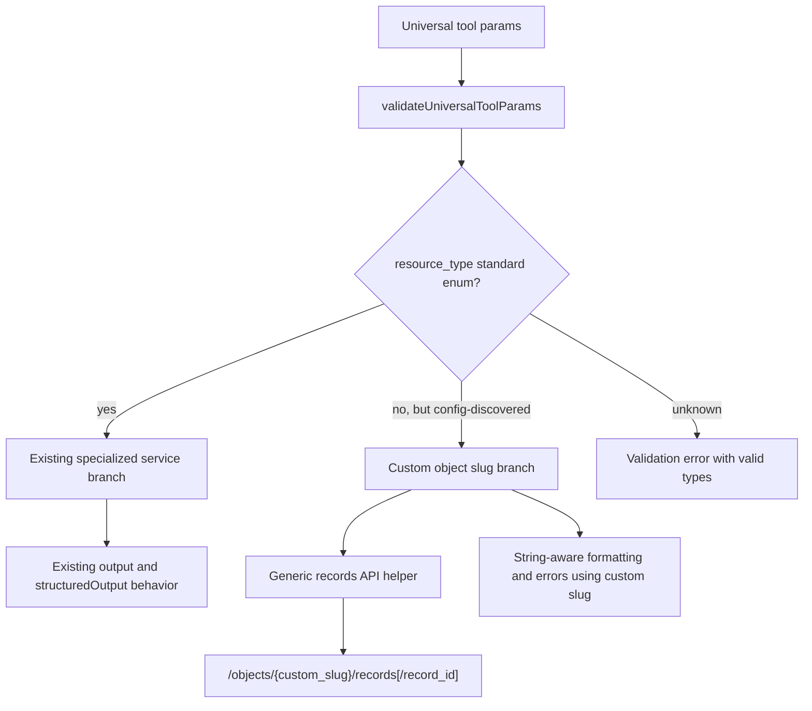

# feat: Complete custom object parity for universal record tools

## Summary

Complete issue #1161 by extending the config-discovered custom object support already used by search tools into `get_record_details`, `create_record`, `update_record`, and `delete_record`. The implementation should reuse the existing dynamic resource-type validation and route validated custom object slugs through the generic Attio records API while preserving specialized behavior for standard objects.

---

## Problem Frame

Custom object slugs discovered into the mapping config are searchable after #1138, but the non-search universal record tools still reject or mishandle those same slugs. This creates partial support: a user can find custom records like `funds` or `orders`, then cannot reliably retrieve, create, update, or delete them through the same universal tool family.

---

## Assumptions

_This plan was authored in LFG pipeline mode without synchronous scope confirmation. The items below are agent inferences that should be reviewed before implementation proceeds._

- Direct custom-object parity means callers may pass a config-discovered custom object slug directly as `resource_type`, for example `resource_type: "funds"`, rather than only using `resource_type: "records"` plus an embedded object slug.
- Standard objects must keep their current specialized service paths where they exist; the generic custom-object path should only handle validated non-standard slugs.
- Relationship-field parity is limited to the existing create/update payload and value-transformer behavior. New relationship discovery or custom relationship tooling remains out of scope.
- Real Attio API validation is useful but not required for local implementation if credentials or safe test data are unavailable; offline tests should prove validation, routing, formatting, and failure handling.

---

## Requirements

- R1. `get_record_details` accepts config-discovered custom object slugs and retrieves the requested record from the matching Attio object.
- R2. `create_record` accepts config-discovered custom object slugs and creates records with custom object field payloads.
- R3. `update_record` accepts config-discovered custom object slugs and updates records with custom object field payloads.
- R4. `delete_record` accepts config-discovered custom object slugs and deletes records from the matching Attio object.
- R5. Validation distinguishes unknown resource types from config-discovered custom object slugs and preserves useful suggestions.
- R6. Create/update field mapping handles custom object attributes without requiring a static `UniversalResourceType` enum entry.
- R7. User-facing formatting and errors use the actual custom object slug instead of falling back to generic `records` or broken singular/plural labels.
- R8. Tests cover validation, routing, formatting, and failure paths for non-search custom object flows.
- R9. Docs and changelog describe the true custom-object support level without overstating unsupported edge cases.

---

## Scope Boundaries

- Do not reopen or re-scope the closed #918 umbrella issue.
- Do not add a new custom object discovery mechanism; this plan depends on existing mapping config discovery.
- Do not alter search-family behavior except for regression coverage where shared helpers change.
- Do not add custom-object batch parity in this PR.
- Do not add new scoped tools for individual custom object names.
- Do not change Attio object schema management; this is record CRUD/detail parity, not object creation/update support.

### Deferred to Follow-Up Work

- Batch custom-object parity for `batch_records`, if users need it after the core CRUD/detail surface is complete.
- Relationship-specific custom object workflows beyond existing field payload handling.
- Live smoke automation for a workspace-owned disposable custom object, if recurring real-API coverage becomes practical.

---

## Context & Research

### Relevant Code and Patterns

- `src/handlers/tools/dispatcher/utils.ts` already exposes `canonicalizeResourceType()` and `getValidResourceTypes()`, merging standard resources with custom object slugs from `loadMappingConfig()`.
- `src/handlers/tool-configs/universal/validators/schema-validator.ts` currently limits dynamic resource-type validation to `search_records`, `search_records_advanced`, and `search_records_by_timeframe`. The non-search tools still use the enum-only validator.
- `test/unit/handlers/tool-configs/universal/validators/schema-validator.test.ts` contains the #1138 regression coverage and currently asserts that `create_record` rejects custom object slugs.
- `src/handlers/tool-configs/universal/core/search-operations.ts` formats custom object result labels through string-aware helpers in `src/handlers/tool-configs/universal/core/utils.ts`.
- `src/handlers/tools/dispatcher/core.ts` can pass the full original argument object into `formatResult`; search already handles that with `extractResourceTypeFromFormatArgs()`, while CRUD/detail formatters still assume the first format arg is a raw resource-type string.
- `src/services/UniversalRetrievalService.ts`, `src/services/UniversalCreateService.ts`, `src/services/UniversalUpdateService.ts`, and `src/services/UniversalDeleteService.ts` still branch on `UniversalResourceType` enum values and use generic object operations only through `records` or `deals` paths.
- `src/objects/records/index.ts` already has generic `createObjectRecord`, `getObjectRecord`, `updateObjectRecord`, and `deleteObjectRecord` helpers that accept object slugs and call Attio `/objects/{object}/records` endpoints.
- `src/services/update/MetadataResolver.ts` and `src/services/update/UpdateOrchestrator.ts` currently assume custom object slugs arrive through `records` object-slug context, not as direct `resource_type` values.
- `docs/universal-tools/user-guide.md` and `docs/universal-tools/api-reference.md` still describe mostly fixed enum-style `resource_type` values and need custom object guidance.

### Institutional Learnings

- No `docs/solutions/` directory exists in this checkout, so there are no repo-local solution notes to carry forward.
- Existing repo guidance requires `bun`, focused tests, structured logging, no secret/PII exposure, and `formatResult` functions that always return strings.
- Prior #1138 search work intentionally kept non-search custom-object support out of scope; this plan is the narrow follow-on.

### External References

- Attio REST docs for [Create a record](https://docs.attio.com/rest-api/endpoint-reference/records/create-a-record) document `POST /v2/objects/{object}/records`, where `{object}` is a UUID or slug.
- Attio REST docs for [Get a record](https://docs.attio.com/rest-api/endpoint-reference/records/get-a-record) document `GET /v2/objects/{object}/records/{record_id}` for people, companies, and other records.
- Attio REST docs for [Update a record](https://docs.attio.com/rest-api/endpoint-reference/records/update-a-record-append-multiselect-values) document `PATCH /v2/objects/{object}/records/{record_id}` for appending multiselect values.
- Attio REST docs for [Delete a record](https://docs.attio.com/rest-api/endpoint-reference/records/delete-a-record) document `DELETE /v2/objects/{object}/records/{record_id}`.

---

## Key Technical Decisions

- Extend dynamic validation to the #1161 tools: use the same config-discovered slug acceptance for `get_record_details`, `create_record`, `update_record`, and `delete_record` that #1138 introduced for search.
- Treat validated non-standard `resource_type` values as direct Attio object slugs: custom object CRUD/detail should call generic record operations with the custom slug, not coerce the operation into the generic `records` enum branch.
- Preserve standard resource paths: companies, people, deals, tasks, lists, notes, and records should continue using existing specialized branches and tests unless shared helper typing needs broadening.
- Keep static field mapping as an enhancement, not a requirement: custom object field payloads should pass through when no static mapping exists, while available-attribute discovery can still support collision detection and display-name resolution.
- Use string-aware display labels for user-facing messages: custom object slugs should remain visible as `funds`, `orders`, or `investment_opportunities` instead of being singularized incorrectly or hidden behind `record`.

---

## Open Questions

### Resolved During Planning

- Should the solution depend on a fresh Attio API object-list call at runtime? No. Existing search support already uses the mapping config as the dynamic source of truth; CRUD/detail parity should use the same mechanism.
- Should callers keep using `resource_type: "records"` plus `object` for custom objects? That path may remain compatible, but #1161 asks for first-class direct custom object slugs across the universal record tools.
- Is external research warranted? Yes. The work touches Attio REST API contracts; current docs confirm the generic `/objects/{object}/records` endpoints support "other records" by object slug.

### Deferred to Implementation

- Exact type alias names for dynamic resource strings: implementation should choose the smallest type change that avoids unsafe enum casts while keeping existing tool params readable.
- Whether post-update field verification can run unchanged for direct custom object slugs: implementation should verify `FieldPersistenceHandler` and metadata fetching behavior under targeted tests and disable only if an existing helper cannot support custom object metadata safely.
- Whether docs should list every custom-object-capable tool in one new section or patch existing schemas inline: choose the smaller doc edit that makes current support clear.

---

## High-Level Technical Design

> _This illustrates the intended approach and is directional guidance for review, not implementation specification. The implementing agent should treat it as context, not code to reproduce._

---

## Implementation Units

- U1. **Unify dynamic resource-type validation for target tools**

**Goal:** Allow config-discovered custom object slugs through validation for `get_record_details`, `create_record`, `update_record`, and `delete_record` without weakening unknown-resource rejection.

**Requirements:** R1, R2, R3, R4, R5, R8

**Dependencies:** None

**Files:**

- Modify: `src/handlers/tool-configs/universal/validators/schema-validator.ts`
- Modify: `test/unit/handlers/tool-configs/universal/validators/schema-validator.test.ts`
- Review: `src/handlers/tools/dispatcher/utils.ts`

**Approach:**

- Replace the search-only dynamic validation set with a clearly named set of universal tools that accept config-discovered object slugs.
- Reuse `canonicalizeResourceType()` and `getValidResourceTypes()` so the dispatcher and tool-handler validation layers share one source of truth.
- Update the existing negative test that says non-search tools reject custom objects; after #1161, it should assert acceptance for the four target tools and rejection only for unknown slugs.
- Keep non-target tools on their current validation rules unless implementation shows they already depend on the same shared validator path and would otherwise regress.

**Execution note:** Start with failing validation tests for all four #1161 tools before changing the validator.

**Patterns to follow:**

- #1138 tests in `test/unit/handlers/tool-configs/universal/validators/schema-validator.test.ts`.
- `canonicalizeResourceType()` and `getValidResourceTypes()` in `src/handlers/tools/dispatcher/utils.ts`.

**Test scenarios:**

- Happy path: `get_record_details` accepts `resource_type: "FUNDS"` from mapping config and returns canonical `funds`.
- Happy path: `create_record`, `update_record`, and `delete_record` each accept `resource_type: "channels"` from mapping config.
- Edge case: standard enum resource types still pass unchanged for all target tools.
- Error path: `resource_type: "unknown_object"` still throws `Invalid resource_type` and includes known standard plus config-discovered values.
- Regression: search-family custom object validation still passes after the shared set is renamed or expanded.

**Verification:**

- Validation tests prove the second validation gate no longer undoes dispatcher acceptance for the #1161 tools.

- U2. **Route custom object details and delete through generic record operations**

**Goal:** Make `get_record_details` and `delete_record` execute against `/objects/{custom_slug}/records/{record_id}` when `resource_type` is a validated custom object slug.

**Requirements:** R1, R4, R7, R8

**Dependencies:** U1

**Files:**

- Modify: `src/services/UniversalRetrievalService.ts`
- Modify: `src/services/UniversalDeleteService.ts`
- Modify: `src/handlers/tool-configs/universal/core/record-details-operations.ts`
- Modify: `src/handlers/tool-configs/universal/core/crud-operations.ts`
- Modify: `test/services/UniversalRetrievalService-core-operations.test.ts`
- Modify: `test/services/UniversalDeleteService.test.ts`
- Test: `test/handlers/tool-configs/universal/core-operations-crud.test.ts`

**Approach:**

- Add a small custom-object detection boundary after validation: if the resource is not a known `UniversalResourceType` but is known to the dynamic validator, route it as an object slug.
- For details, call `getObjectRecord(customSlug, recordId)` and keep field filtering compatible with the returned Attio record shape.
- For delete, call `deleteObjectRecord(customSlug, recordId)` and return the existing `{ success, record_id }` shape.
- Update formatting to use string-aware labels so custom object details and deletion messages include the custom slug.
- Avoid broad refactors in standard retrieval/delete branches.

**Patterns to follow:**

- Generic object helpers in `src/objects/records/index.ts`.
- String-aware label helpers in `src/handlers/tool-configs/universal/core/utils.ts`.
- Existing list-specific preservation in `src/services/UniversalRetrievalService.ts` as a model for keeping standard special cases intact.

**Test scenarios:**

- Happy path: `UniversalRetrievalService.getRecordDetails({ resource_type: "funds", record_id })` calls the generic object-record helper with `funds` and returns the Attio record.
- Happy path: `UniversalDeleteService.deleteRecord({ resource_type: "funds", record_id })` calls the generic delete helper with `funds` and returns success.
- Edge case: details field filtering still returns only requested `values` fields for a custom object record.
- Error path: a not-found error from the generic record helper surfaces as a not-found details/delete error that names `funds`, not generic `records`.
- Regression: companies, people, deals, tasks, lists, notes, and `records` keep their existing branch behavior.

**Verification:**

- Details and delete service tests prove direct custom object slugs reach the generic `/objects/{slug}/records/{record_id}` path.

- U3. **Route custom object create/update with field mapping and metadata support**

**Goal:** Make `create_record` and `update_record` accept custom object field payloads and route them through generic records API helpers with the custom object slug.

**Requirements:** R2, R3, R5, R6, R7, R8

**Dependencies:** U1

**Files:**

- Modify: `src/services/UniversalCreateService.ts`
- Modify: `src/services/UniversalUpdateService.ts`
- Modify: `src/services/update/MetadataResolver.ts`
- Modify: `src/services/update/UpdateOrchestrator.ts`
- Modify: `src/services/update/strategies/RecordUpdateStrategy.ts`
- Modify: `src/handlers/tool-configs/universal/field-mapper/transformers/record-transformer.ts`
- Modify: `src/handlers/tool-configs/universal/field-mapper/validators/field-validator.ts`
- Modify: `test/services/UniversalCreateService-objects-deals-tasks.test.ts`
- Modify: `test/services/UniversalUpdateService-core-operations.test.ts`
- Modify: `test/services/update/MetadataResolver.test.ts`

**Approach:**

- Broaden internal service typing where necessary from enum-only resource types to dynamic resource strings at the service boundary, while preserving enum-specific branches for standard objects.
- For direct custom object creates, derive the object slug from `resource_type`, discover attributes for that slug when available, map/validate fields with graceful pass-through when no static mapping exists, and call the generic record create strategy/helper.
- For direct custom object updates, derive the object slug from `resource_type`, fetch metadata for that slug, run existing mapping/normalization/value-transformer steps where they support dynamic attributes, and dispatch to the generic record update strategy with the custom slug.
- Ensure custom object payloads do not require `record_data.object`, `record_data.object_slug`, or `record_data.object_api_slug` when the object slug is already supplied as `resource_type`.
- Keep the current `records` compatibility path that extracts object slug from `record_data` for callers already using that shape.

**Execution note:** Add characterization coverage for create and update routing before broadening service types; this area has multiple validation and value-transformation hooks.

**Patterns to follow:**

- `RecordCreateStrategy` and `RecordUpdateStrategy` for generic object operations.
- Existing `records` object-slug extraction in `UniversalCreateService` and `MetadataResolver`.
- `mapRecordFields()` pass-through behavior when no static mapping exists.

**Test scenarios:**

- Happy path: `UniversalCreateService.createRecord({ resource_type: "funds", record_data: { name: "Fund I" } })` calls generic create with object slug `funds` and a values payload.
- Happy path: `UniversalUpdateService.updateRecord({ resource_type: "funds", record_id, record_data: { status: "Active" } })` calls generic update with object slug `funds`.
- Edge case: custom object create/update with `record_data.values` and top-level `record_data` both map to the expected values envelope.
- Edge case: no static field mapping for `funds` produces pass-through mapping, not validation failure.
- Error path: field collision or Attio validation errors still surface through the existing CRUD error enhancer path with the custom slug label.
- Regression: `resource_type: "records"` still requires or uses embedded object slug context as it does today.
- Regression: deal-specific validation and task-specific content immutability remain unchanged for standard resources.

**Verification:**

- Create/update tests prove custom object slugs are used as object slugs and payloads are not forced through the `records` enum branch.

- U4. **Normalize custom object formatting and error labels**

**Goal:** Ensure success and failure messages for custom object details/create/update/delete use the actual custom object slug consistently.

**Requirements:** R7, R8

**Dependencies:** U2, U3

**Files:**

- Modify: `src/handlers/tool-configs/universal/core/utils.ts`
- Modify: `src/handlers/tool-configs/universal/core/crud-error-handlers.ts`
- Modify: `src/handlers/tool-configs/universal/shared-handlers.ts`
- Modify: `src/services/UniversalUtilityService.ts`
- Modify: `test/handlers/tool-configs/universal/core-operations-crud.test.ts`
- Modify: `test/unit/handlers/tool-configs/universal/core/search-operations.test.ts`
- Test: `test/unit/handlers/universal/crud-error-handlers.test.ts`

**Approach:**

- Prefer existing string-aware helpers such as `getSingularResourceLabel()` and `getPluralResourceLabel()` where user-facing labels can receive custom object slugs.
- Use `extractResourceTypeFromFormatArgs()` or the same dispatcher-argument normalization pattern in CRUD/detail formatters so both raw string args and full params objects produce correct labels.
- Avoid enum casts before formatting custom object labels; if a helper must remain enum-only for compatibility, add a string-aware wrapper at the caller.
- Keep custom object slugs unchanged rather than applying naive singularization. `investment_opportunities` is a better label than a broken singular guess.
- Preserve existing standard labels like `company`, `person`, `deal`, and `task`.

**Patterns to follow:**

- #1138 search formatting in `src/handlers/tool-configs/universal/core/search-operations.ts`.
- `getPluralResourceLabel()` and `getSingularResourceLabel()` in `src/handlers/tool-configs/universal/core/utils.ts`.

**Test scenarios:**

- Happy path: create success for `resource_type: "funds"` says `funds` and includes the record display name/ID.
- Happy path: update success and delete success for `resource_type: "orders"` say `orders`.
- Happy path: details output for `resource_type: "investment_opportunities"` starts with that slug as the record label.
- Edge case: CRUD/detail formatters receive `{ resource_type: "funds", ... }` as their first format arg and still resolve the label as `funds`, not `[object Object]`.
- Error path: create/update/delete fallback errors say `Failed to create funds`, `Failed to update funds`, or `Failed to delete funds`, not `record` or `fundss`.
- Regression: standard resources still format as `company`, `person`, `deal`, `task`, and `list`.

**Verification:**

- Formatter and error-handler tests prove custom object labels are stable and user-visible.

- U5. **Document support level and update release notes**

**Goal:** Update user-facing docs and changelog to describe custom object CRUD/detail parity accurately.

**Requirements:** R9

**Dependencies:** U1, U2, U3, U4

**Files:**

- Modify: `CHANGELOG.md`
- Modify: `README.md`
- Modify: `docs/universal-tools/user-guide.md`
- Modify: `docs/universal-tools/api-reference.md`
- Modify if relevant: `docs/universal-tools/troubleshooting.md`
- Modify if relevant: `docs/api/api-overview.md`

**Approach:**

- Add a concise `[Unreleased]` changelog entry tied to #1161.
- Update universal tools docs to say config-discovered custom object slugs are accepted for search plus `get_record_details`, `create_record`, `update_record`, and `delete_record`.
- Include one example using a custom object slug directly as `resource_type`.
- Note the dependency on running object/attribute discovery so the mapping config contains the custom object slug.
- Avoid claiming batch, relationship-specific, or object-schema management parity.

**Patterns to follow:**

- Existing #1138 changelog entry for custom object search support.
- Existing universal tools examples in `docs/universal-tools/user-guide.md` and `docs/universal-tools/api-reference.md`.

**Test scenarios:**

- Test expectation: none -- documentation-only unit. Verification is by review against the final implemented support level.

**Verification:**

- Docs no longer describe custom objects as generic `records` only and do not overstate unsupported batch or relationship-specific behavior.

---

## System-Wide Impact

- **Interaction graph:** MCP tool params flow through `validateUniversalToolParams()`, into core tool configs, then into universal services. The change affects validation, service routing, generic record helpers, formatting, and docs for the four non-search record tools.
- **Error propagation:** Unknown slugs should fail at validation. Config-discovered slugs should reach Attio and surface Attio validation/not-found errors through existing CRUD/detail error paths with custom object context.
- **State lifecycle risks:** Create/update/delete are write operations. Incorrect custom object slug routing could mutate or delete records from the wrong object, so tests must assert the exact object slug passed to generic helpers.
- **API surface parity:** Standard resources keep existing behavior. Search-family custom object support remains unchanged. Direct custom object slugs become first-class for details/create/update/delete.
- **Integration coverage:** Unit tests prove routing and formatting. A real API smoke is useful if safe custom object test data exists, but the plan does not require creating production custom object data.
- **Unchanged invariants:** Tool names, schema names, MCP approval annotations, and scoped company/deal tools remain unchanged.

---

## Risks & Dependencies

| Risk                                                                                                            | Mitigation                                                                                                                         |
| --------------------------------------------------------------------------------------------------------------- | ---------------------------------------------------------------------------------------------------------------------------------- |
| Dynamic validation accepts slugs that downstream services still type as enum-only                               | Broaden the service boundary deliberately and test each target operation with a non-standard slug.                                 |
| Custom object create/update accidentally routes through the generic `records` object instead of the actual slug | Assert generic helper calls receive the custom slug from `resource_type`.                                                          |
| Field validation rejects valid custom object attributes because no static mapping exists                        | Preserve pass-through behavior when static mappings are absent and rely on available-attribute discovery when possible.            |
| Error and formatter helpers hide custom object labels behind `record`                                           | Add string-label tests for all four target tool families.                                                                          |
| Real API behavior differs from offline mocks                                                                    | Use official Attio records endpoint contracts in design and run live smoke only when credentials and safe test data are available. |

---

## Documentation / Operational Notes

- This PR should target issue #1161 and mention related context from #918 and #1138.
- If `ATTIO_API_KEY` is available and a disposable custom object exists, run a read/write smoke against that object only with explicit cleanup. Otherwise, state the live validation gap in the PR.
- Update docs after implementation so they match the actual supported edge cases rather than the intended design.

---

## Sources & References

- Related issue: [#1161](https://github.com/kesslerio/attio-mcp-server/issues/1161)
- Related issue: [#918](https://github.com/kesslerio/attio-mcp-server/issues/918)
- Related issue: [#1138](https://github.com/kesslerio/attio-mcp-server/issues/1138)
- Related code: `src/handlers/tool-configs/universal/validators/schema-validator.ts`
- Related code: `src/handlers/tools/dispatcher/utils.ts`
- Related code: `src/services/UniversalCreateService.ts`
- Related code: `src/services/UniversalUpdateService.ts`
- Related code: `src/services/UniversalRetrievalService.ts`
- Related code: `src/services/UniversalDeleteService.ts`
- Related code: `src/objects/records/index.ts`
- External docs: [Attio create a record](https://docs.attio.com/rest-api/endpoint-reference/records/create-a-record)
- External docs: [Attio get a record](https://docs.attio.com/rest-api/endpoint-reference/records/get-a-record)
- External docs: [Attio update a record](https://docs.attio.com/rest-api/endpoint-reference/records/update-a-record-append-multiselect-values)
- External docs: [Attio delete a record](https://docs.attio.com/rest-api/endpoint-reference/records/delete-a-record)
