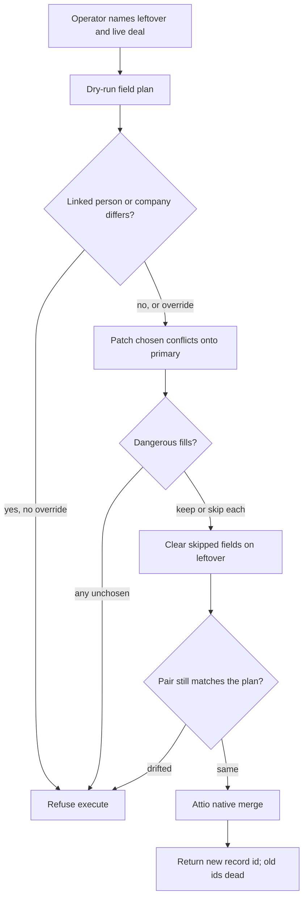

# Safe Deal Merge - Plan

## Goal Capsule

- Objective: Sales-ops can collapse a leftover Demo Request deal into the live booked or Won sibling without losing unique form-snapshot fields and without clobbering live sales fields; the survivor is a new Attio record and both original deal IDs are dead.
- Means: One universal `merge_records` tool, deals-gated, wrapping Attio native merge with PUT leftover clears and no in-tool 202 poll (KTD1, KTD2, KTD4).
- Product authority: This plan owns deals-first merge. People and companies are later coverage on the same operation, not active scope.
- Open blockers: None.

---

## Product Contract

Product Contract unchanged: R1–R17, A1–A3, F1–F4, AE1–AE6 keep their IDs and meaning.

### Summary

Add one MCP merge operation, gated to deals at launch, that previews leftover vs live deal, lets the operator patch chosen conflict values onto the primary and skip dangerous fills by clearing them on the leftover, then runs Attio native merge. Execute re-diffs and refuses if the pair drifted, returns the new record id, and warns that both old ids are unreadable.

### Problem Frame

Duplicate Demo Request leftovers sit next to a booked or Won sibling on the same person. The leftover still holds the latest form snapshot (website, zip, interest, UTMs, form id). The later deal holds stage, owner, notes, and real value. Deleting the leftover throws the snapshot away. Copying blindly can overwrite Won stage or stamp `consent_to_contact=false` onto a live opportunity. Attio's UI still cannot merge deals. This MCP server only has update and delete, so every agent session reinvents a lossy cleanup.

### Key Decisions

- Deals-first, same operation later. First ship executes deals only; people and companies are refused until a later opening. (session-settled: user-directed — chosen over full objects this round, and over preview-only: the pain is leftover deals.) Governs R1, R2.
- Wrap Attio native merge, including the new record id. (session-settled: user-directed — chosen over keep-the-live-id fill-then-delete: the API already accepts deals.) Governs R3, R16, R17.
- Per-field patch onto primary, then merge. (session-settled: user-directed — chosen over swap-entire-primary or abort, and over dry-run-show-only: keep Won as primary while still taking leftover `demo_request_at` when wanted.) Governs R11, R12.
- Flag dangerous empty-primary fills (consent=false, stage, owner, value). (session-settled: user-directed — chosen over conflicts-only: empty primary is how those fields get clobbered.) Governs R6, R10.
- Skip a dangerous fill by clearing it on the leftover, then merge. (session-settled: user-directed — chosen over unset-after-merge and abort-if-skip: the live deal stays empty for that field.) Governs R13.
- Linked person or company mismatch blocks execute unless override. (session-settled: user-directed — chosen over flag-and-proceed and always-abort-no-override.) Governs R7.
- Dry-run defaults on; execute needs explicit confirm. (session-settled: user-directed — chosen over dry-run-false-enough and a two-step plan token: an agent must not collapse records in one unreviewed call.) Governs R4, R14.
- One gated merge operation with execute-time freshness check. (session-settled: user-approved — chosen over a deals-only scoped tool and over a separate preview/apply pair: people/companies can open later without a rename; re-diff catches a stale pair without a second tool.) Governs R1, R15.
- Dangerous fills are strict keep-or-skip; unresolved both-set conflicts default to primary-wins. (session-settled: user-approved — packaged with the chosen approach.) Governs R10, R11.

<!-- ce-section: work-relationships -->

### How This Work Fits Together

This plan owns deals-first merge for leftover vs live sibling deals. The broader duplicate-cleanup picture below is the current understanding, not a committed roadmap.

- People and companies merge on the same operation
  - Depends on this deals-gated merge shipping first
  - Still to decide: per-object dangerous-fill policy and a live smoke merge per object before opening the gate
- Unique-key upsert (`#1191`)
  - Can proceed independently of this plan
  - Shares the "do not invent a second record" problem; it creates-or-updates by key rather than collapsing two existing records
- Attio UI merge for people and companies
  - Can proceed independently of this plan
  - Outside this MCP operation's job

### Actors

- A1. Sales-ops operator cleaning leftover Demo Request deals next to booked or Won siblings (the issue author, via an agent).
- A2. Agent calling the merge operation.
- A3. Attio native merge, which mints the surviving record and re-parents notes, tasks, and list memberships.

### Requirements

**Operation surface**

- R1. The MCP exposes one merge operation that takes an object type and, at first ship, executes only for deals.
- R2. People and companies are refused with a message that this version is deals-only; Attio UI merge remains the path for those objects until this operation is opened for them.
- R3. The tool description states that merge is not idempotent, returns a new record id, and is a beta Attio capability.

**Dry-run plan**

- R4. Dry-run is the default and does not merge, patch, or clear any record.
- R5. Dry-run reports both-set conflicts with both values, including timestamps such as `demo_request_at`.
- R6. Dry-run flags dangerous empty-primary fills for `consent_to_contact=false`, stage, owner, and deal value so the operator can keep or skip each.
- R7. Dry-run flags a differing associated person or company; execute is blocked unless the operator passes an explicit override.
- R8. Self-merge is rejected.
- R9. Notes, tasks, and list memberships are omitted from the field plan; Attio re-parents them onto the new record.

**Execute**

- R10. Execute is refused unless every flagged dangerous fill has an explicit keep or skip.
- R11. Both-set conflicts with no chosen patch keep the primary value.
- R12. When the operator chooses the secondary value on a conflict, execute writes that value onto the primary before native merge.
- R13. When the operator skips a dangerous fill, execute clears that attribute on the leftover, then merges, so the surviving deal stays empty for that field.
- R14. Execute requires an explicit confirm in addition to turning dry-run off.
- R15. Before mutating, execute re-diffs the pair and refuses if the set of flagged conflicts, fills, or linked mismatches differs from the plan being confirmed.
- R16. Execute uses Attio native merge; the response returns the new record id and warns that both original ids are unreadable.
- R17. If Attio reports the merge is still applying, the operation returns a wait state with the new record id rather than treating the survivor as readable.

### Key Flows



- F1. Preview leftover vs live sibling
  - **Trigger:** A2 calls merge with dry-run default for a leftover Demo Request and a booked or Won primary.
  - **Actors:** A1, A2
  - **Steps:** Load both deals; emit keep / fill / conflict / skip / linked-mismatch; mutate nothing.
  - **Outcome:** A1 can see timestamp conflicts and dangerous fills before anything is written.
  - **Covered by:** R4, R5, R6, R7, R9

- F2. Patch then native merge
  - **Trigger:** A1 confirms execute with chosen conflict patches and keep/skip on every flagged fill.
  - **Actors:** A1, A2, A3
  - **Steps:** Re-diff per R15; write chosen secondary values onto primary; clear skipped leftover fills; native merge; return new id plus dead-id warning.
  - **Outcome:** Won stays primary for live sales fields; leftover snapshot fills empty primary fields; leftover is gone.
  - **Covered by:** R10, R11, R12, R13, R14, R15, R16

- F3. Linked mismatch without override
  - **Trigger:** The two deals point at different companies or people and no override is passed.
  - **Actors:** A2
  - **Steps:** Dry-run flags the mismatch; execute is refused.
  - **Outcome:** Two different businesses are not collapsed.
  - **Covered by:** R7

- F4. Stale pair between preview and execute
  - **Trigger:** Either deal changes after dry-run so the flagged set no longer matches.
  - **Actors:** A2
  - **Steps:** Execute re-diffs and refuses.
  - **Outcome:** A resolution set is not applied against a different plan.
  - **Covered by:** R15

### Acceptance Examples

- AE1. Leftover form snapshot into Won
  - **Covers R5, R11, R12, R16.**
  - **Given:** Primary is Won with stage, owner, and value set; leftover is Demo Request with empty-on-primary website, zip, UTMs, and form id; `demo_request_at` differs.
  - **When:** Dry-run, then execute with primary as Won, leftover timestamp chosen onto primary, no dangerous-fill skips needed if those live fields are already set.
  - **Then:** Dry-run listed the timestamp conflict and the snapshot fills; the new record keeps Won stage/owner/value, has leftover snapshot fields, has the chosen timestamp, and neither original id is readable.

- AE2. Skip consent=false fill
  - **Covers R6, R10, R13.**
  - **Given:** Primary consent is empty; leftover has `consent_to_contact=false`.
  - **When:** Dry-run flags that fill; execute skips it.
  - **Then:** Leftover consent is cleared before merge; the surviving deal does not receive `false`.

- AE3. Unreviewed execute refused
  - **Covers R4, R14.**
  - **Given:** An agent calls merge with no confirm.
  - **When:** Dry-run is left at default, or confirm is omitted.
  - **Then:** No merge, patch, or clear occurs.

- AE4. Company mismatch without override
  - **Covers R7.**
  - **Given:** Leftover and live deal point at different companies.
  - **When:** Execute is attempted without override.
  - **Then:** Execute is refused; dry-run named the mismatch.

- AE5. Self-merge
  - **Covers R8.**
  - **Given:** Primary and leftover are the same record id.
  - **When:** Merge is called.
  - **Then:** The call is rejected without mutating Attio.

- AE6. Drift between preview and confirm
  - **Covers R15.**
  - **Given:** Dry-run ran; then leftover website was edited so the fill set changed.
  - **When:** Execute is confirmed against the old plan.
  - **Then:** Execute refuses; no patch, clear, or merge runs.

### Success Criteria

- A leftover Demo Request can be collapsed into a booked or Won sibling in one reviewed execute without losing unique empty-on-primary snapshot fields and without overwriting primary stage, owner, or value.
- Agents cannot merge two deals in a single unreviewed call.
- Operators always receive the new record id and a warning that both old ids are dead.
- `ce-plan` can implement without inventing which object ships first, how conflicts resolve, or what blocks execute.

### Scope Boundaries

**In scope**

- Deals-only execute of the gated merge operation, including dry-run, per-field patch, leftover clear on skip, freshness re-diff, confirm, and native merge wait/new-id behavior.

**Deferred for later**

- Opening the same operation for people and companies (per-object dangerous-fill policy plus a live smoke merge each).
- A separate read-only preview alias if host approval prompts on dry-run become painful.
- Batch merge of more than one pair.

**Outside this product's identity**

- Unique-key upsert (`#1191`) — create-or-update, not collapse of two existing records.
- Attio UI merge for people and companies.
- A per-field picker inside Attio's merge itself.

### Dependencies / Assumptions

- Attio `POST /v2/objects/{object}/records/merge` accepts deals in this workspace (fake-id probe returned the same `value_not_found` as people and companies). A live smoke merge of two throwaway deals still belongs in planning before coding against the endpoint.
- Native merge primary-wins / secondary-fills, new record id, non-idempotency, self-merge rejection, and in-progress unreadability are as documented at [Merge two records](https://docs.attio.com/rest-api/endpoint-reference/records/merge-two-records).
- Skip-clear uses Attio overwrite PUT with `[]`, not the repo PATCH update path (PATCH prepends multiselect). Record-reference `[]` is proven in-repo; checkbox `consent_to_contact` unset is unverified until live smoke.
- Stage and owner defaults are not injected on update, so patching the primary before merge will not stamp defaults.
- Help Center UI merge remains people and companies only ([Merge and delete records](https://attio.com/help/reference/managing-your-data/records/merge-and-delete-records)).

### Outstanding Questions

**Resolve Before Planning**

- None.

**Deferred to Implementation**

- Exact Attio slugs for dangerous-fill fields and `demo_request_at` (discover from deal attributes at runtime; do not hardcode guessed titles).
- If live smoke cannot unset checkbox `consent_to_contact`, stop and confirm a fallback with the operator before changing R13.

### Sources / Research

- Issue [#1264](https://github.com/kesslerio/attio-mcp-server/issues/1264).
- Attio merge API: [Merge two records](https://docs.attio.com/rest-api/endpoint-reference/records/merge-two-records).
- Attio UI limitation: [Merge and delete records](https://attio.com/help/reference/managing-your-data/records/merge-and-delete-records).
- No merge client or tool in this repo: `src/api/operations/index.ts`, `src/handlers/tool-configs/universal/core/index.ts`.
- Adjacent dry-run precedent: `create-list` dry-run (default false) in `src/handlers/tool-configs/lists.ts`.
- Clear-on-update: `src/services/value-transformer/record-reference-transformer.ts`; deal defaults skipped on update in `src/config/deal-defaults.ts`.
- Related but distinct: `#1191` upsert in `BACKLOG.md`.
- Attio overwrite PUT vs PATCH: PATCH prepends multiselect; skip-clear must PUT `[]`. Do not use generic `callWithRetry` on merge POST (retry confirmed 429 only).
- Agent-native: dry-run returns a structured field plan; 202 is a wait state, not an in-tool poll.

---

## Planning Contract

### Summary

Ship one universal MCP tool `merge_records`, gated to deals, that (1) builds a field plan from leftover vs live, (2) dry-runs by default, (3) on `confirm` patches chosen values onto the primary, PUT-clears skipped leftover attributes, then POSTs Attio native merge, and (4) returns the new record id plus a 200 complete or 202 wait payload. People/companies refuse until a later opening of the same tool.

### Key Technical Decisions

- **KTD1 — Tool name `merge_records` (universal, deals-gated).** One tool, `resource_type` required; refuse any type other than `deals` with a later-coverage message. Not `merge_deal`. Governs R1, R2. Alternatives: scoped deals-only tool (rejected: Approach B already chosen); two-tool preview/apply (rejected: freshness re-diff lives on one operation).
- **KTD2 — 202 is a wait state, not an in-tool poll.** Return `new_record_id` plus merge-in-progress guidance; the agent follows up with `get_record_details`. `get_record_details` treats a 404/`merge_in_progress` on that id as wait-not-missing. Governs R17.
- **KTD3 — Skip-clear uses overwrite PUT, not PATCH.** Dedicated `overwriteRecordAttributes` helper PUTs `values: { slug: [] }` on the leftover. Existing `updateRecord` PATCH stays for primary patches (`isUpdate: true` so deal defaults do not inject). Governs R13.
- **KTD4 — Merge-safe retry.** Merge POST retries only confirmed HTTP 429 after Retry-After. Timeout and 5xx are indeterminate: do not resend (non-idempotent). Do not wrap merge in generic `callWithRetry`. Governs R16, AE6.
- **KTD5 — Dual execute gate + static destructive annotation.** Schema: `dry_run` defaults true; execute requires `confirm: true` (boolean, no top-level oneOf). `destructiveHint: true` even on dry-run because hosts cannot flip annotations by argument. Dual gate remains load-bearing. Governs R8, R9.
- **KTD6 — Keep / skip / override as flat arrays.** `keep_from_leftover: string[]` (attribute slugs to patch onto primary before merge), `skip_leftover_attributes: string[]` (PUT-clear on leftover), `override_linked_mismatch: boolean` (default false). Validate combinations in the handler. Governs R11–R14.
- **KTD7 — Live smoke before coding against merge POST.** Two throwaway deals: prove deals merge, PUT-clear of record-references, and whether checkbox `consent_to_contact` can unset. If checkbox cannot clear, stop — do not silently change R13. Governs R13, AE2.

### Code Reuse

- CRUD client and retry types: `src/api/operations/crud.ts`, `src/api/operations/retry.ts`, `src/api/operations/index.ts`.
- Universal tool registration and formatResult: `src/handlers/tool-configs/universal/core/crud-operations.ts`, `src/handlers/tool-configs/universal/core/index.ts`.
- Deal update defaults skip: `src/config/deal-defaults.ts`.
- Empty-array record-reference transform: `src/services/value-transformer/record-reference-transformer.ts`.
- Universal errors: `ErrorService.createUniversalError` — throw, do not return `{ isError: true }`.
- Dry-run shape (lists, default false — invert default here): `src/handlers/tool-configs/lists.ts`.
- MCP e2e layout: `test/e2e/mcp/deal-operations/` (create if missing); `bun run test:mcp`.

### Implementation Units

#### U1: Merge API client and PUT overwrite

- **Goal:** Prove deals merge with two throwaway records, then add `mergeRecords` (POST `/v2/objects/{object}/records/merge`) and `overwriteRecordAttributes` (PUT record values) with merge-safe retry.
- **Requires:** none
- **Required by:** U2, U4
- **Files:** Create `src/api/operations/merge.ts` (or add to `crud.ts` if that stays under ~500 lines). Modify `src/api/operations/index.ts`, `src/api/operations/retry.ts` only if a 429-only helper is cleaner than duplicating Retry-After parsing.
- **Approach:** Live-smoke first with `ATTIO_API_KEY`. Primary + secondary deal IDs; assert 200/202 and new `record_id`. PUT `[]` on a record-reference and on `consent_to_contact` if present. Then implement POST merge (`primary_record_id`, `secondary_record_id`) mapping 200 vs 202. Retry 429 only. Surface `self_merge` 400 clearly.
- **Patterns to follow:** `src/api/operations/crud.ts` client + path helpers; do not copy `callWithRetry` onto merge POST.
- **Test scenarios:**
  - Happy: merge two mocked deals returns new id and status 200.
  - 202: returns wait payload with `new_record_id`, does not poll.
  - 429: retries once after Retry-After; 500 timeout: no retry.
  - 400 self_merge: throws mapped error.
  - PUT overwrite sends `[]` for named slugs.
- **Verification:** `bun run typecheck` and unit tests for merge client. Live smoke notes (pass/fail of checkbox clear) in the unit's commit message or a short comment in the helper — not a committed secret dump.
- **Execution note:** Live-smoke first. If checkbox cannot unset, stop and do not invent a skip-clear workaround.

#### U2: Field plan, dangerous fills, linked mismatch, re-diff

- **Goal:** Pure service that diffs leftover vs live deal attributes into keep/fill/conflict/dangerous-empty-fill, blocks linked person/company mismatch unless override, and re-diffs at execute if the flagged set drifted.
- **Requires:** U1 (only for attribute fetch via existing get-record; merge client unused here)
- **Required by:** U3, U4
- **Files:** Create `src/services/merge/deal-merge-planner.ts` (and small types file if needed). Split if >500 lines.
- **Approach:** Load both records. Classify each attribute: both empty, primary-only, leftover-only fill, both-set conflict (including timestamps like `demo_request_at`). Dangerous empty-primary fills: `consent_to_contact=false`, stage, owner, value — flag as keep-or-skip, never auto-fill. Linked person/company: if both set and IDs differ, execute-block unless `override_linked_mismatch`. Re-diff: hash or serialize the flagged attribute set; refuse execute on drift (AE4).
- **Patterns to follow:** Existing record value extraction in `src/handlers/tool-configs/universal/core/value-extractors.ts`; UUID checks `isValidUUID`.
- **Test scenarios:**
  - Happy: leftover-only website/UTM proposed as fills; live stage kept.
  - Conflict: both have `demo_request_at` → listed, applied only if in `keep_from_leftover`.
  - Dangerous fill: leftover `consent_to_contact=false`, live unset → skip required to execute.
  - Linked mismatch: different company IDs → block without override; proceed with override.
  - Re-diff: mutated leftover between plan and execute → refuse.
  - Empty/nil records or invalid UUIDs → validation error, no API merge.
- **Verification:** `bun run test:single` on the planner test file.
- **Execution note:** test-first for classification and re-diff.

#### U3: `merge_records` tool surface

- **Goal:** Register universal `merge_records` with deals gate, dry-run default true, confirm required to execute, flat keep/skip/override args, `formatResult` string, `destructiveHint: true`.
- **Requires:** U2
- **Required by:** U4
- **Files:** Create `src/handlers/tool-configs/universal/core/merge-operations.ts`. Modify `src/handlers/tool-configs/universal/core/index.ts` and whatever schema/types registry lists tool names (search `delete_record` registration). No top-level oneOf/allOf/anyOf.
- **Approach:** Handler validates `resource_type === 'deals'` else throw universal error. `record_id` (primary/live) and `secondary_record_id` (leftover). `dry_run` default true. Execute only when `confirm === true` (R8/R9: `dry_run: false` alone is not enough). Dry-run returns formatted field plan (conflicts, dangerous fills, proposed patches, skips). People/companies: refuse with later-coverage copy. Throw `ErrorService.createUniversalError` on failure.
- **Patterns to follow:** `src/handlers/tool-configs/universal/core/crud-operations.ts` (delete_record annotations, formatToolDescription, formatResult string + try/catch + createErrorResult).
- **Test scenarios:**
  - Dry-run default: no confirm → no merge POST.
  - `dry_run: false` without confirm → refuse.
  - `resource_type: companies` → refuse, no API call.
  - formatResult is string in all branches.
- **Verification:** unit tests for handler gating + `bun run typecheck`.
- **Execution note:** none

#### U4: Execute orchestration (patch, PUT-clear, merge, 200/202)

- **Goal:** On confirm, re-diff, patch primary with `keep_from_leftover`, PUT-clear `skip_leftover_attributes` on leftover, POST merge, map 200 vs 202; treat merge-in-progress 404 on get as wait-not-missing.
- **Requires:** U1, U2, U3
- **Required by:** U5
- **Files:** Merge service execute path (same module as U2 or `src/services/merge/deal-merge-executor.ts`). Modify `src/handlers/tool-configs/universal/core/record-details-operations.ts` (or get-record error mapping) so `merge_in_progress` 404 is wait-not-missing when the id was a merge product.
- **Approach:** No spanning transaction. If merge fails after leftover clear, surface that leftover was already cleared (AE6). Do not retry merge on timeout/5xx. Success payload includes `new_record_id` and warning that both original IDs are unreadable.
- **Patterns to follow:** Universal update path for primary patches (`isUpdate: true`). PUT helper from U1 for leftover clears.
- **Test scenarios:**
  - Execute with keep website + skip consent: primary patched, leftover consent PUT-cleared, merge called once.
  - 202: formatted wait + new id; get_record_details wait-not-missing.
  - Merge error after clear: error mentions leftover already cleared; no silent retry.
- **Verification:** unit tests with mocked API; `bun run typecheck`.
- **Execution note:** none

#### U5: Tests, MCP e2e, CHANGELOG

- **Goal:** Unit coverage for planner/gating/retry; MCP e2e under `test/e2e/mcp/deal-operations/` for dry-run and (API-keyed) execute on throwaway deals; Unreleased CHANGELOG entry `#1264`.
- **Requires:** U1–U4
- **Required by:** none
- **Files:** Create `test/e2e/mcp/deal-operations/merge-records.mcp.test.ts` (or similar). Modify `CHANGELOG.md`. Add unit tests beside U1–U4 modules under `test/`.
- **Approach:** MCP tests follow existing `*.mcp.test.ts`. Cleanup throwaway deals via API token filter. CHANGELOG Added, user-facing, no trailing period, issue `#1264`.
- **Patterns to follow:** `test/e2e/mcp/core-operations/create-records.mcp.test.ts`; mock factories in `test/utils/mock-factories/`.
- **Test scenarios:** MCP dry-run returns field plan without merging; execute with confirm merges throwaways when `ATTIO_API_KEY` is set (skip otherwise).
- **Verification:** `bun run typecheck && bun run test:single <unit files> && bun run lint:src`. MCP: `bun run test:mcp` when key present.
- **Execution note:** none

### Requirements Trace

| ID             | Implementation                                 |
| -------------- | ---------------------------------------------- |
| R1, R2         | U3 deals gate                                  |
| R3, R16        | U1 native merge + new id                       |
| R4–R7, R10–R12 | U2 field plan / dangerous fills / keep         |
| R8, R9         | U3 dual gate                                   |
| R13            | U1 PUT + U4 skip-clear                         |
| R14            | U2 linked mismatch                             |
| R15            | U2 + U4 re-diff                                |
| R17            | U1/U4 202 wait; U4 get_record_details mapping  |
| A1–A3          | U3/U4 payloads                                 |
| F1–F4          | U3 refuse; U2 skip semantics; no extra objects |
| AE1–AE6        | U2–U4 error paths; U1 429-only retry           |

### Test Strategy

- **Unit:** planner classification, dual gate, retry policy, formatResult string, people/companies refuse.
- **MCP e2e:** dry-run and execute against Attio when `ATTIO_API_KEY` is set; skip execute otherwise.
- **Not in this ship:** full people/companies merge; in-tool 202 polling.

### Verification

```sh
bun run typecheck
bun run test:single test/services/merge/deal-merge-planner.test.ts
bun run lint:src
```

Plus merge-client and tool-handler unit files created in U1/U3. `bun run test:mcp` when API key is available.

### Definition of Done

- `merge_records` dry-runs a leftover vs live deals field plan by default.
- Execute requires `confirm`, patches keep slugs onto primary, PUT-clears skips on leftover, POSTs native merge, returns new id.
- Non-deals resource types refuse. 202 does not poll. CHANGELOG Unreleased mentions `#1264`.
- Checkbox skip-clear either proven by live smoke or explicitly blocked pending operator fallback.
