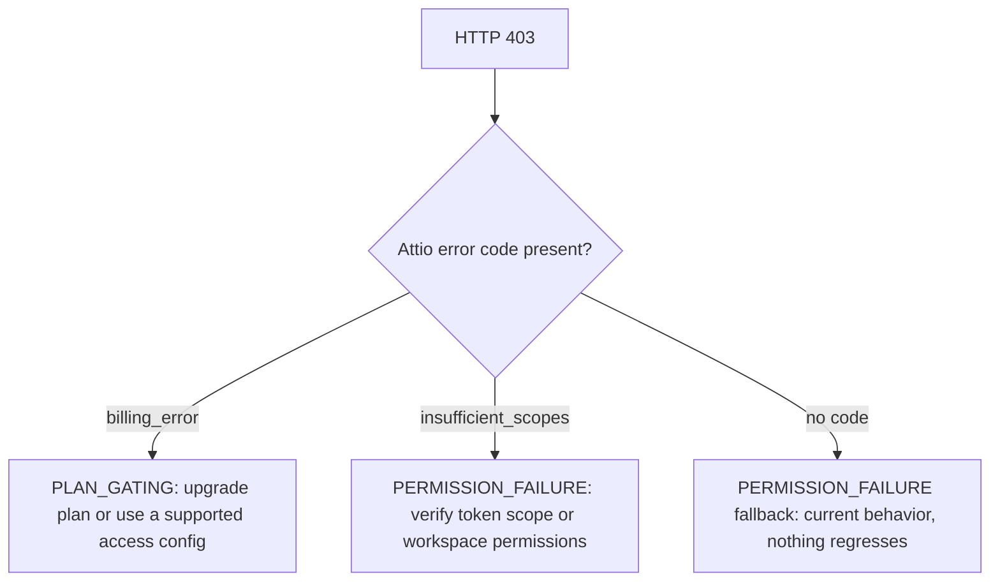
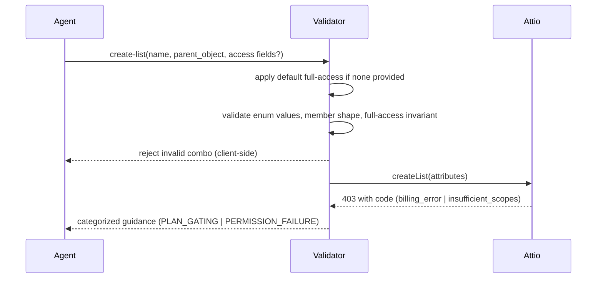

# List Access-Control Hardening - Plan

## Goal Capsule

**Objective:** Agents in restricted Attio workspaces can create and update lists with explicit access-control configuration, and receive clear, actionable errors that distinguish plan/billing gating from permission failures — instead of a generic "Insufficient permissions" dead-end.

**Product authority:** The five decisions settled in dialogue govern this plan: explicit access-field support, proactive client-side validation, a distinct plan-gating error category, coverage of both the dedicated and universal list surfaces, and a full-access default. Surrounding list tooling is not active scope.

**Open blockers:** None. The create-time full-access invariant and the 403 billing-error behavior are verified against Attio's public API docs.

---

## Product Contract

### Summary

Harden the list create/update flows so `workspace_access` and `workspace_member_access` are first-class inputs with client-side validation of the deterministic rules, and make 403 errors distinguish plan/billing gating from permission failures via a new distinct category — applied across both the dedicated `create-list`/`update-list-configuration` tools and the universal `create_record`/`update_record` path for lists.

### Problem Frame

Teams using restricted lists or newer list-sharing controls hit confusing failures. The MCP currently passes access-control fields through generically — they only reach Attio via the free-form `attributes` bag — and maps every 403 to a generic "Insufficient permissions" message. But Attio's 403 can be a billing error when the workspace plan does not support advanced workspace or member-level list access. Agents waste debugging time and cannot tell malformed input from missing permissions from plan gating.

### Requirements

**Access-Control Field Support**

- R1. The dedicated `create-list` and `update-list-configuration` tools expose `workspace_access` and `workspace_member_access` as first-class input fields, not only via the free-form attributes bag.
- R2. `workspace_access` accepts the Attio enum (`full-access`, `read-and-write`, `read-only`, `null` for a private list) and `workspace_member_access` accepts an array of `{workspace_member_id, level}` entries with the Attio level enum.
- R3. When the agent provides neither access field on create, default to `workspace_access: full-access` (workspace-wide).
- R4. The universal `create_record`/`update_record` path with `resource_type: "lists"` supports the same access-control fields, and `workspace_access` is added to the list field-mapping valid fields.

**Client-Side Validation**

- R5. Client-side validation rejects deterministic violations before hitting Attio: invalid access-level enum values, malformed member-entry shape, and the create-time hard invariant (after applying the default, at least one full-access grantee must exist via `workspace_access: full-access` or a member entry with `level: full-access`).
- R6. Validation is stateless: it does not read the list's current access state to validate merged update results. Update-time access changes surface as server-side errors with categorized guidance.
- R7. The client does not re-implement Attio's member-override-beats-workspace-default merge semantics.

**403 Classification**

- R8. A new `PLAN_GATING` error category is added, distinct from `PERMISSION_FAILURE`.
- R9. 403 classification keys on Attio's structured error code: `billing_error` → PLAN_GATING (plan/billing gating), `insufficient_scopes` → PERMISSION_FAILURE. When no code is present, fall back to the current PERMISSION_FAILURE behavior so nothing regresses.
- R10. The classification applies to both the dedicated tools and the universal path via a shared classifier.
- R11. User-facing errors explain the likely next step (upgrade plan or use a supported access configuration for plan-gating; verify token scope or workspace permissions for permission failure) instead of a generic list failure.

### Key Decisions

- **Explicit support + validation over reject-with-guidance** (session-settled: user-directed — chosen over reject-with-targeted-guidance and 403-classification-only: the user wants real first-class field support). Governs R1, R2, R4.
- **Proactive client-side validation over pass-through** (session-settled: user-directed — chosen over pass-through+categorization and hybrid: fast feedback, no wasted API call). Governs R5, R6, R7.
- **New PLAN_GATING category over folding into PERMISSION_FAILURE** (session-settled: user-directed — chosen over fold-in and single AUTH_FAILURE: agents need programmatic distinction). Governs R8, R9.
- **Both dedicated + universal surfaces** (session-settled: user-directed — chosen over dedicated-only and skip-universal-403: consistent behavior everywhere). Governs R4, R10.
- **Default to full-access** (session-settled: user-directed — chosen over require-explicit and default-private: safe default, avoids billing errors on restrictive plans). Governs R3.
- **Stateless validation over stateful pre-flight** (session-settled: user-approved — the agent proposed Approach A with the tradeoff surfaced; the user assented). Governs R6, R7.
- **Code-driven classification over message matching** (session-settled: user-approved — the agent proposed Approach A; the user assented). Governs R9.

The 403 classification is a two-way decision boundary:

### Scope Boundaries

- Stateful pre-flight for updates (reading current access state to catch "this update removes the last full-access grantee") — deferred; only if update misconfiguration proves common in practice.
- Capability-learning inversion (caching a plan-gated verdict per workspace to pre-warn future attempts) — deferred until retry-loop evidence shows it is needed.
- Entry-level list tools (`add-record-to-list`, `filter-list-entries`) — unchanged, not in scope.
- List deletion tool — not in scope.
- List attribute management tools — deferred (from the prior list-configuration plan).

### Acceptance Examples

- AE1. **Covers R1, R2, R5.** Agent creates a list with `workspace_access: read-only` and no full-access member → rejected client-side with guidance that a full-access grantee is required.
- AE2. **Covers R3.** Agent creates a list with only name and parent_object → defaults to `workspace_access: full-access`, succeeds.
- AE3. **Covers R8, R9.** Attio returns 403 with `billing_error` → categorized as PLAN_GATING with upgrade-plan guidance.
- AE4. **Covers R9.** Attio returns 403 with `insufficient_scopes` → categorized as PERMISSION_FAILURE with token-scope guidance.
- AE5. **Covers R10.** Universal `create_record` with `resource_type: "lists"` and a 403 → same categorized guidance as the dedicated tool.
- AE6. **Covers R4.** Universal `create_record` with `workspace_access` field → accepted (field-mapping gap fixed).

### Dependencies / Assumptions

- Assumption: Attio reliably includes the structured error code on 403 responses. If not, the fallback preserves current permission-failure behavior.
- Assumption: The create-time full-access invariant is a documented hard rule (verified from Attio's public API docs).

### Sources / Research

- Attio list create endpoint docs — `workspace_access`/`workspace_member_access` schema, the full-access invariant, and the 403 `billing_error` response.
- Attio list access docs — workspace vs member-level access semantics.
- Repo: `src/services/lists/ListConfigurationValidator.ts` (current `categorizeError`), `src/services/lists/types.ts` (`ListErrorCategory`), `src/handlers/tool-configs/lists.ts` (tool schemas), `src/handlers/tool-configs/universal/field-mapper/constants/lists.ts` (valid fields).
- Prior plan: `docs/plans/2026-05-13-001-feat-list-configuration-tools-plan.md` (R12 defers access-control hardening to #1148).

---

## High-Level Technical Design

The change is a focused hardening of the existing list configuration path. Three mechanisms compose it: a code-driven 403 classifier, a stateless access-control validator, and first-class schema exposure. The classifier and validator live in the shared `ListConfigurationValidator` so both the dedicated tools and the universal path consume the same logic.

**403 classification flow.** The classifier reads the Attio error body's structured code, not the message string. When the body carries `billing_error`, the category is `PLAN_GATING`; when it carries `insufficient_scopes`, the category is `PERMISSION_FAILURE`. A 403 with no code falls back to the existing `PERMISSION_FAILURE` behavior so nothing regresses. The decision boundary is shown in the Product Contract diagram.

**Access-control validation flow.** On create, the validator applies the default (`workspace_access: full-access`) when neither access field is provided, then checks: the `workspace_access` value is a valid enum, each `workspace_member_access` entry has a valid `{workspace_member_id, level}` shape, and at least one full-access grantee exists (via `workspace_access: full-access` or a member entry with `level: full-access`). This is stateless — it never reads the current list state, so update-time access changes are left to Attio and surfaced through the classifier.

**Schema exposure.** The dedicated tools expose `workspace_access` as a string enum and `workspace_member_access` as an array-of-objects, mirroring the Attio API shape. The universal field-mapper's valid fields gain `workspace_access`.

---

## Planning Contract

### Implementation Units

- U1. Add `PLAN_GATING` category and code-driven 403 classification.
- U2. Expose access-control fields on the dedicated tool schemas and wire them through the dispatcher.
- U3. Add stateless access-control validation and the full-access default.
- U4. Fix the universal field-mapping gap and apply validation/classification to the universal path.
- U5. Add integration coverage for restricted-access list behavior.

### Dependencies and Sequencing

- U1 is foundational — the classifier must exist before the error-path tests assert it.
- U2 and U3 are independent of each other but both depend on U1's category semantics being stable.
- U4 depends on U1 (shared classifier) and U3 (shared validator).
- U5 depends on U2–U4 being implemented; it exercises the end-to-end behavior.

### Verification Strategy

- Unit tests for the classifier (U1), the validator (U3), and the schema/dispatcher wiring (U2).
- Strategy tests for the universal path (U4).
- Integration tests for restricted-access behavior (U5), gated on a real Attio API key.

---

## Implementation Units

### U1. `PLAN_GATING` category and code-driven 403 classification

**Goal:** Add `PLAN_GATING` to the list error categories and make `categorizeError` distinguish plan/billing gating from permission failures by inspecting the Attio error body's structured code.

**Files:**

- `src/services/lists/types.ts` — add `PLAN_GATING = 'plan_gating'` to `ListErrorCategory`.
- `src/services/lists/ListConfigurationValidator.ts` — extend `categorizeError` to read the error body's `code` field (via `error.response.data.code` or the `AttioApiError` body) and map `billing_error` → `PLAN_GATING`, `insufficient_scopes` → `PERMISSION_FAILURE`, fallback → existing `PERMISSION_FAILURE`.

**Technical design:** The existing `extractStatus` helper reads `error.response.status`. Add a companion that reads `error.response.data.code` (and the `AttioApiError` body code). The 403 branch becomes: if code is `billing_error`, return `PLAN_GATING` with a plan-gating message and upgrade-plan next step; otherwise return `PERMISSION_FAILURE` with the existing permission message. The `ListErrorCategory` enum gains the new member. No message-string matching — key on the code field only.

**Test scenarios:**

- Happy path: 403 with `billing_error` → `PLAN_GATING` category, next step mentions upgrade/plan.
- Edge: 403 with `insufficient_scopes` → `PERMISSION_FAILURE` category, next step mentions token scope/permissions.
- Edge: 403 with no code → `PERMISSION_FAILURE` fallback (existing behavior preserved).
- Error path: `AttioApiError` with a body carrying `billing_error` → `PLAN_GATING`.
- Regression: existing 403 → `PERMISSION_FAILURE` tests still pass.

**Execution note:** Test-first — add the failing `PLAN_GATING` tests, then implement the classifier.

### U2. Expose access-control fields on dedicated tool schemas

**Goal:** Make `workspace_access` and `workspace_member_access` first-class inputs on `create-list` and `update-list-configuration`, and pass them through the dispatcher.

**Files:**

- `src/handlers/tool-configs/lists.ts` — add `workspace_access` (string enum: `full-access`, `read-and-write`, `read-only`, `null`) and `workspace_member_access` (array of `{workspace_member_id, level}` objects) to the `create-list` and `update-list-configuration` `inputSchema` properties.
- `src/handlers/tools/dispatcher/operations/lists.ts` — in `handleCreateListOperation` and `handleUpdateListConfigurationOperation`, read the new fields and merge them into the attributes passed to `createList`/`updateList`.

**Technical design:** Follow the existing array-of-object schema convention (type `array`, `items` with `type: 'object'`, `properties`, `required`). The `workspace_member_access` items require `workspace_member_id` (uuid) and `level` (enum). In the dispatcher, when `workspace_access` is provided it is passed directly; `workspace_member_access` is passed as its array. The `attributes` bag remains as a fallback for other fields.

**Test scenarios:**

- Happy path: `create-list` with `workspace_access: read-only` and a member entry → fields reach Attio.
- Edge: `workspace_access` enum accepts all four values; rejects an invalid value.
- Edge: `workspace_member_access` array shape accepted; malformed entries rejected.
- Error path: invalid enum value → validation error before the API call.
- Regression: existing `create-list`/`update-list-configuration` tests pass.

### U3. Stateless access-control validation and full-access default

**Goal:** Add client-side validation of the deterministic access rules and apply the full-access default on create.

**Files:**

- `src/services/lists/ListConfigurationValidator.ts` — add a `validateAccessControls` method.
- `src/handlers/tools/dispatcher/operations/lists.ts` — call it in `handleCreateListOperation` (and `handleUpdateListConfigurationOperation` for the shape checks).
- `src/services/create/strategies/ListCreateStrategy.ts` — call it in the universal create path.

**Technical design:** The validator applies the default (`workspace_access: full-access`) when neither access field is provided, then checks the enum values, the member-entry shape, and the create-time full-access invariant. It throws a `UniversalValidationError` with targeted guidance on violation. It is stateless — no read of current list state. The update path runs only the shape checks (enum values, member-entry shape), not the invariant, since the merged result is not knowable client-side.

**Test scenarios:**

- Happy path: create with neither access field → default `workspace_access: full-access` applied, invariant satisfied.
- Happy path: create with `workspace_access: full-access` → passes.
- Happy path: create with a member entry `level: full-access` → passes (invariant satisfied via member).
- Edge: `workspace_access: read-only` with no full-access member → rejected with full-access-grantee guidance.
- Edge: invalid `workspace_access` value → rejected.
- Edge: malformed `workspace_member_access` entry (missing `workspace_member_id` or `level`) → rejected.
- Error path: update with invalid enum value → rejected (shape check only).

### U4. Universal field-mapping gap and universal path

**Goal:** Add `workspace_access` to the list field-mapping valid fields and apply the validation/classification to the universal `create_record`/`update_record` path for lists.

**Files:**

- `src/handlers/tool-configs/universal/field-mapper/constants/lists.ts` — add `workspace_access` to `validFields`.
- `src/services/create/strategies/ListCreateStrategy.ts` — call the access validation.
- `src/services/update/strategies/ListUpdateStrategy.ts` — call the shape checks.
- `src/services/lists/ListConfigurationValidator.ts` — the shared classifier already covers the universal path's error handling.

**Technical design:** The field-mapper's `validFields` gains `workspace_access` (it already has `workspace_member_access`). The create/update strategies call the same `validateAccessControls`/shape checks as the dedicated tools. The universal error path already routes through `categorizeError` for the shared classification.

**Test scenarios:**

- Happy path: universal `create_record` with `resource_type: "lists"` and `workspace_access` → accepted, field-mapping gap fixed.
- Happy path: universal `update_record` with `workspace_member_access` → accepted.
- Error path: universal 403 with `billing_error` → same categorized guidance as dedicated tool.
- Regression: existing universal list create/update tests pass.

### U5. Integration coverage for restricted-access list behavior

**Goal:** Add integration coverage for restricted-access list read/write behavior, satisfying the acceptance criterion.

**Files:**

- `test/e2e/` or `test/integration/` — new integration test exercising restricted-access list behavior.

**Technical design:** Use the real Attio API (gated on `ATTIO_API_KEY`). Cover: creating a list with a restricted access configuration, reading it back, and the 403 classification when the workspace plan does not support advanced access. Follow the existing integration test conventions.

**Test scenarios:**

- Integration: create a list with `workspace_access: read-only` + a member entry → succeeds.
- Integration: create a list with no access fields → defaults to full-access, succeeds.
- Integration: 403 with `billing_error` on a plan-gated workspace → categorized as `PLAN_GATING`.

---

## Verification Contract

- **Unit tests:** `test/services/lists/ListConfigurationValidator.test.ts` (U1, U3), `test/services/lists/list-configuration-tools.test.ts` (U2), `test/services/lists/list-strategies-hardening.test.ts` (U4).
- **Strategy tests:** `test/services/UniversalCreateService-core-resources.test.ts`, `test/services/UniversalUpdateService-core-operations.test.ts` (U4).
- **Integration tests:** new restricted-access integration test (U5), gated on `ATTIO_API_KEY`.
- **Commands:** `bun run typecheck`, `bun run test`, `bun run lint:src`, `bun run lint:check`.

---

## Definition of Done

- The `create-list` and `update-list-configuration` tools expose `workspace_access` and `workspace_member_access` as first-class inputs (R1, R2).
- Create defaults to `workspace_access: full-access` when neither access field is provided (R3).
- The universal path supports the access-control fields and `workspace_access` is in the field-mapping valid fields (R4).
- Client-side validation rejects deterministic violations with targeted guidance (R5), is stateless (R6), and does not re-implement Attio's merge semantics (R7).
- A `PLAN_GATING` category exists distinct from `PERMISSION_FAILURE` (R8), and 403 classification keys on the Attio code (R9).
- The classification applies to both the dedicated and universal surfaces (R10).
- User-facing errors explain the likely next step (R11).
- Integration coverage exists for restricted-access list read/write behavior.
- `bun run typecheck`, `bun run test`, and `bun run lint:check` pass.
