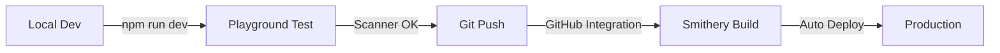

# Smithery CLI Quick Reference

## Essential Commands

```bash
# Development
npm run dev           # Start Smithery dev server with Playground
npm run dev:build     # Build then start dev server
npm run build:watch   # Watch mode for TypeScript compilation

# Testing
npm run test:offline  # Run tests without API calls
npm run check         # Run all checks (lint, format, typecheck)

# Deployment
npm run build         # Build for production
git push origin main  # Deploy via GitHub integration
```

## File Structure

```
attio-mcp-server/
├── src/
│   ├── smithery.ts          # 🎯 Smithery entry point (exports createServer)
│   ├── server/
│   │   └── createServer.ts  # Server factory with context injection
│   ├── api/
│   │   └── lazy-client.ts   # Lazy API key initialization
│   └── handlers/
│       ├── tools/           # Tool implementations
│       ├── resources.ts     # Resource handlers
│       └── prompts.ts       # Prompt handlers
├── smithery.yaml            # 🎯 Smithery configuration
├── package.json             # Dev scripts and dependencies
└── docs/
    └── smithery-dev-setup.md # This guide
```

## Key Configuration Files

### smithery.yaml
```yaml
runtime: "typescript"    # Use TypeScript runtime (not container)
startCommand:
  type: http             # HTTP transport (Smithery handles it)
exampleConfig:           # Empty for scanner compatibility
  ATTIO_API_KEY: ""
  ATTIO_WORKSPACE_ID: ""
```

### src/smithery.ts
```typescript
// Must export default function named createServer
export default function createServer({ config }) {
  // config contains per-session settings from Playground
  return buildServer(context);
}

// Optional: Export schema for UI
export const configSchema = z.object({
  ATTIO_API_KEY: z.string().optional(),
  // ... other fields
});
```

## Testing Checklist

### Local Development
- [ ] `npm run build` succeeds
- [ ] `npm run dev` opens Playground
- [ ] Scanner completes (green checkmarks)
- [ ] Tools appear in Tools tab
- [ ] `aaa-health-check` works without API key
- [ ] Resources returns empty array without key

### With API Key
- [ ] Add API key in Playground config
- [ ] Search tools work
- [ ] Create/update operations succeed
- [ ] Session persists across calls

### Before Deploying
- [ ] `npm run check` passes
- [ ] `npm run test:offline` passes
- [ ] No TypeScript errors
- [ ] Scanner works locally

## Common Patterns

### No-Auth Tool (for scanner)
```typescript
{
  name: 'aaa-health-check',  // Alphabetically first
  description: 'Health check that works without API key',
  handler: async () => ({
    content: [{ type: 'text', text: 'OK' }]
  })
}
```

### Lazy API Key Check
```typescript
const apiKey = context.getApiKey?.();
if (!apiKey) {
  return {
    isError: true,
    message: 'Missing ATTIO_API_KEY. Add in Playground settings.'
  };
}
```

### Discovery without Auth
```typescript
// In resources handler
try {
  const resources = await fetchResources();
  return { resources };
} catch {
  // Return empty for scanner
  return { resources: [] };
}
```

## Troubleshooting

| Issue | Solution |
|-------|----------|
| Scanner fails | Ensure `aaa-health-check` tool exists and works |
| No tools shown | Check `export default function createServer` |
| Build errors | Run `npm run build` and fix TypeScript issues |
| Port in use | Kill existing processes or change PORT |
| Config not shown | Export `configSchema` from smithery.ts |
| Session errors | Verify using TypeScript runtime, not Express |

## Environment Variables

```bash
# Development
MCP_LOG_LEVEL=DEBUG     # Enable debug logging
PORT=3000               # Server port (Smithery sets this)

# API Keys (fallback if not in config)
ATTIO_API_KEY=xxx       # Attio API key
ATTIO_WORKSPACE_ID=xxx  # Optional workspace ID
```

## Deployment Flow



## Key Concepts

- **TypeScript Runtime**: Smithery builds and wraps your server
- **Session Management**: Handled automatically by Smithery
- **Config Injection**: Per-session config from Playground UI
- **Scanner**: Runs with empty config to discover capabilities
- **Lazy Loading**: API keys only required when tools execute

## Links

- [Smithery CLI Docs](https://smithery.ai/docs/build/cli)
- [TypeScript Runtime](https://smithery.ai/docs/build/deployments/typescript)
- [Playground Guide](https://smithery.ai/docs/getting_started/quickstart_connect)
- [MCP Specification](https://modelcontextprotocol.io/specification)

---

*Pro tip: Keep `npm run dev` running while developing for instant feedback!*