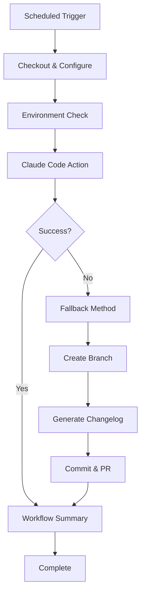

# Daily Changelog Workflow

## Overview

The daily changelog workflow automatically generates changelog entries by analyzing git commits from the last 24 hours. It runs at 8 PM PT daily and can also be triggered manually.

The changelog is intentionally focused on **meaningful product changes**:

- Bug fixes
- New features
- Refactors or performance improvements that impact UX/behavior

Commits are considered "meaningful" when their subject line starts with one of these prefixes:

- `Fix:`
- `Feature:`
- `Refactor:`
- `Perf:`
- `UI:`
- `UX:`

Commits using other prefixes (for example `Chore:`, `Docs:`, `Test:`) are generally excluded from the automated daily changelog.

> **Note:** These prefixes are **case-sensitive** and must appear exactly at the start of the commit subject line. For example, `fix:` (lowercase) or `Feature(scope):` will not be matched.

## Improvements Made

### Key Issues Resolved

1. **Permission Errors**: Fixed Claude Code action permission issues by:
   - Adding explicit `token: ${{ github.token }}` to checkout step
   - Configuring git user properly for automated commits
   - Adding environment checks to validate permissions

2. **Reliability**: Added robust fallback mechanism that:
   - Uses traditional GitHub Actions if Claude Code action fails
   - Provides consistent output regardless of which method succeeds
   - Includes comprehensive error handling

3. **Observability**: Added debugging and monitoring features:
   - Environment validation checks
   - Detailed logging at each step
   - Summary report with success/failure status
   - Links to created PRs for easy access

### Workflow Architecture



## Workflow Steps

### 1. Environment Setup

- Checkout repository with full git history
- Configure git user as `github-actions[bot]`
- Validate tools and permissions

### 2. Primary Method (Claude Code Action)

- Analyze commits using AI
- Categorize changes intelligently
- Create well-formatted changelog entries
- Handle edge cases and complex commit patterns

### 3. Fallback Method (Traditional Actions)

- Parse commits using regex patterns
- Categorize into Added/Fixed/Changed sections
- Generate basic but functional changelog entries
- Ensure workflow never fails completely

### 4. Output Generation

- Create branch: `chore/daily-changelog-YYYY-MM-DD`
- Update `CHANGELOG.md` after `## [Unreleased]` section
- Commit changes with descriptive message
- Create pull request automatically

Only **one** Daily changelog PR should be open at any given time. If an open PR with title matching `chore: Daily changelog for [date]` already exists, the workflow will skip creating a new branch/PR for that run.

## Manual Testing

Use the provided test script to debug locally:

```bash
./scripts/test-changelog.sh
```

This script:

- Shows what commits would be included
- Generates preview of changelog content
- Allows testing branch creation and PR workflow
- Provides cleanup instructions

## Configuration

### Schedule

```yaml
schedule:
  - cron: '0 4 * * *' # 8 PM PT daily (4 AM UTC next day)
```

### Manual Trigger

Go to Actions → Daily Changelog → Run workflow

### Required Permissions

```yaml
permissions:
  contents: write # Create branches, commit files
  pull-requests: write # Create PRs
  id-token: write # GitHub authentication
```

## Troubleshooting

### Common Issues

1. **No Meaningful Changes**
   - Workflow will output: "No meaningful changes since yesterday"
   - This is expected behavior, not an error
   - Common reasons:
     - Only `Chore:`, `Docs:`, or `Test:` commits in the last 24 hours
     - No commits at all in the last 24 hours

2. **Permission Denied**
   - Check if `CLAUDE_CODE_OAUTH_TOKEN` secret is configured
   - Verify token has repository write permissions
   - Fallback method should still work

3. **Claude Code Action Timeout**
   - Fallback method will activate automatically
   - Check logs for "using fallback method" message

### Debugging Steps

1. **Check Environment**:

   ```bash
   # In workflow logs, look for "Environment Check" section
   git status
   gh auth status
   git log --since="1 day ago" --oneline
   ```

2. **Test Locally**:

   ```bash
   ./scripts/test-changelog.sh
   ```

3. **Manual Workflow**:
   ```bash
   # Create changelog manually if needed
   git checkout -b chore/daily-changelog-$(date +%Y-%m-%d)
   # Edit CHANGELOG.md
   git add CHANGELOG.md
   git commit -m "chore: Daily changelog for $(date +%Y-%m-%d)"
   git push -u origin HEAD
   gh pr create --title "chore: Daily changelog for $(date +%Y-%m-%d)"
   ```

## Changelog Format

Generated entries follow this structure:

```markdown
## [YYYY-MM-DD] - Daily Update

### Added

- New features with PR/issue references (#123)

### Fixed

- Bug fixes with PR/issue references (#456)

### Changed

- Refactoring/improvements with PR/issue references (#789)

### Documentation

- Docs updates with PR/issue references (#101)
```

## Workflow Outputs

### Success Indicators

- ✅ Status: SUCCESS in workflow summary
- 📝 Branch created: `chore/daily-changelog-YYYY-MM-DD`
- 🔗 PR link provided in summary

### Monitoring

- Check GitHub Actions for daily runs
- Look for PRs with title pattern: "chore: Daily changelog for [date]"
- Monitor workflow summary for status updates

## Future Improvements

Potential enhancements to consider:

- Integration with issue/PR templates
- Automated changelog section ordering
- Support for breaking change detection
- Integration with semantic versioning
- Slack/email notifications on failure
